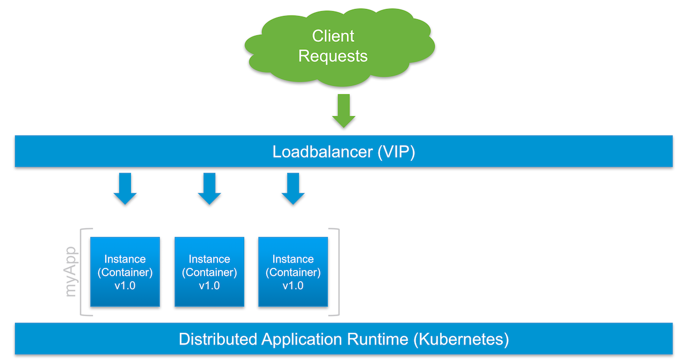
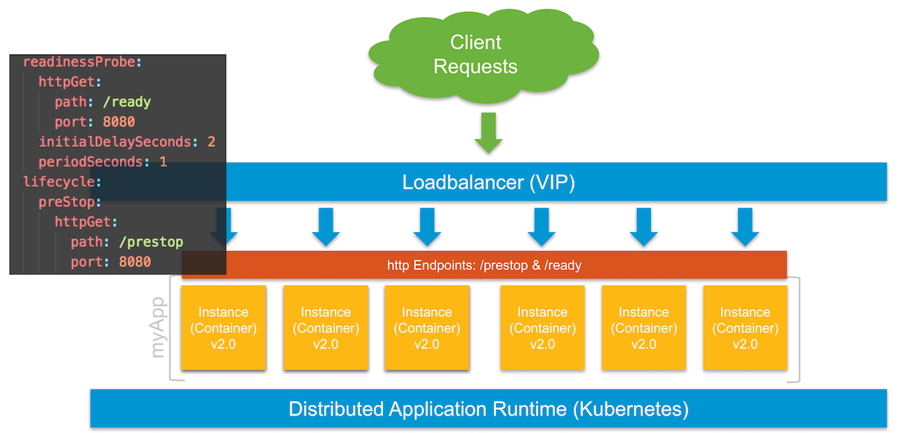

# Explain the use of readiness probes and prestop (lifecycle) hooks
Motivation: if applications are not correctly designed to handle SIGTERM and close open handlers, traffic routing from the services load-balancer will return CONN_CLOSED or CONN_TIMEOUT errors to the caller (client) during scaling (e.g. scale down) or rolling updates. Obviously, this leads to a bad user experience.

Using a readiness probe as well as pre-signaling SIGTERMs to a pod (prestop hook) avoids such errors by coordinating the action with the distributed components (API server, endpoints, kube-proxy, pods, etc.). 

# How this demo is structured
Two simple web servers with different build versions (v1 and v2) are used, so we can make use of Kubernetes´ rolling updates. Both servers expose various http handlers (endpoints). Important are the "prestop" and "healthz" handlers, which act as a communication bridge for Kubernetes orchestration workflows, e.g. scaling and updating deployments. The web servers are also designed for graceful shutdowns (`srv.shutdown()` method), so in-flight connections will be served before shutting down the process on SIGTERM.  

It´s important to make use of the exposed handlers in the `deployment.yaml` specification, i.e. under `readiness` and `prestop`. Otherwise Kubernetes will simply activate/ terminate pods in the endpoint list (load balancer) without further delay. You can read more about the internals [here](https://github.com/embano1/vmworld2017/blob/master/01_probe/cmd/web/main.go#L86). 

# Quickstart
 - Have a running Kubernetes environment (examples assume minikube and kubectl to be installed)
  - Tested with Kubernetes v1.6.4
- You will also need a http benchmark tool like [go-wrk](https://github.com/adjust/go-wrk) or [hey](https://github.com/rakyll/hey), or the poor men´s approach running `curl` in a shell loop 
- Clone this repo with `git clone https://github.com/embano1/vmworld2017`
- cd into the folder `01_probe` on your machine
- `kubectl create -f kubernetes/withprobes/` (this will create the pods, namespace and service defaulting to `--type NodePort`)
  - You can also deploy the `noprobes` example along the `withprobes` demo
  - This is the naive approach, prone to connection errors, drops, etc.
  - By default, it will be deployed in a separate namespace `noprobes` so you don´t run into naming or port issues
- Get the external port the service is exposed: `kubectl get --namespace probes service simpleprobe -o json|grep nodePort`
  - Example output: `"nodePort": 31461`
  - Access the service via browser or `curl "$(minikube ip):31461"` (replace the port with your output)
  - In case you use minikube, you can also get the external service address with `minikube service list`
  - A simple website with some stats and the version (v1.0) is shown
- Now open at least two terminal windows
  - #1 to run the benchmark to simulate load while scaling/ live updating the deployment
  - #2 to interact with the Kubernetes cluster
  - You might want to open additional terminals to watch what Kubernetes is doing behind the scenes, e.g. `watch -n1 kubectl --namespace probes get pod`
  - In terminal #1
    - Start the benchmark, e.g. `hey -n 40000 $(minikube service --namespace probes --url simpleprobe)` (or use `<Kubernetes_IP>:<NodePort>`)
    - This will run 30k requests against the Kubernetes load-balancer and, depending on your machine, will give us enough time to kick off scaling/ rolling updates
  - Immediately in terminal #2, either do
    - a scale down operation: `kubectl --namespace probes scale deployment simpleprobe --replicas 3` or 
    - a rolling update (to v2.0 of the app) operation: `kubectl --namespace probes set image deployment/simpleprobe simpleweb=embano1/simpleweb:2.0`
    - Your benchmark should complete without any 4xx errors
    - Now try the same with the `noprobes` example in the Kubernetes folder
    - You can follow the rolling update procedure in another terminal window with `while true; do curl -s $(minikube service --url --namespace probes simpleprobe)|grep Vers; sleep 1; done`
- When finished, tear down the demo with `kubectl delete -f kubernetes/<folder>`  

# In case you want to build/ modify the code
- Requirements
  - `go` [installed](https://golang.org/dl/)
  - `make` tool installed
  - `Docker` [installed](https://docs.docker.com/engine/installation/) and running (to build/ push the images)
- `go get -u -d github.com/embano1/vmworld2017`
- The Go source code is located in `cmd`
- cd into the folder `01_probe/cmd` on your machine
- For each subfolder (web...)
  - cd into the subfolder
  - At least change MAINTAINER in the `Dockerfile` and point REPOTAG to your Docker hub ID in the `Makefile`
  - Then you´re ready to `make all`

