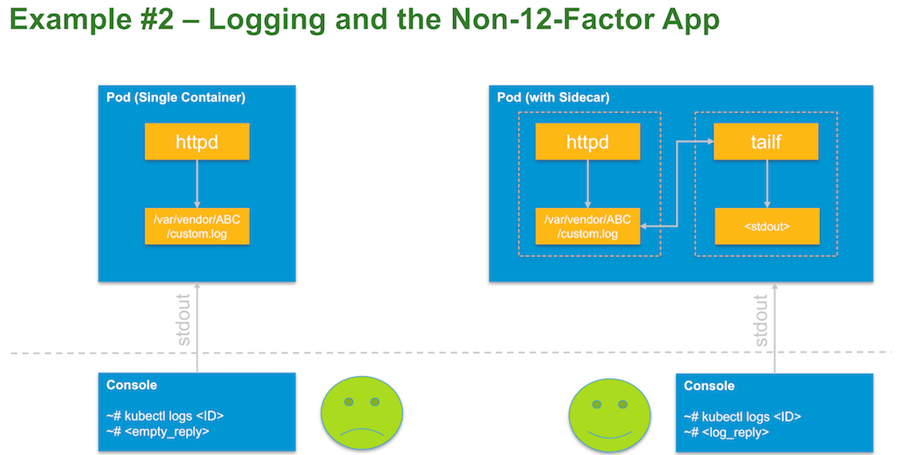

# Explain the use of a sidecar container within a pod
Motivation: if applications are not correctly designed to log to stdout (e.g. hard-coded path, no access to source code to modify), one can use a sidecar container to be deployed together with the application in the same pod. Kubernetes `kubectl logs` command relies on the app to log to stdout in order to show log information (12 Factor App principle). 

Since the sidecar container has access to the same container namespaces (mount, i.e. storage), one can use a shared (local, exclusive) volume for all containers within the same pod. Sidecar containers can also be used to mimic agent functionality, e.g. download configuration files, send logs to other endpoints, etc.

More composite patterns for pods can be found here [http://blog.kubernetes.io/2015/06/the-distributed-system-toolkit-patterns.html].

# How this demo is structured
The pod contains two containers, one web server and one "log-to-stdout" container (sidecar) which behaves like `tail -f`. The web server is hard-coded to log to /log/http.log. The sidecar follows each line in the log and prints it to stdout, so `kubectl logs` eventually works.



# Quickstart
- Have a running Kubernetes environment (examples assume minikube and kubectl to be installed)
  - Tested with Kubernetes v1.6.4
- Clone this repo with `git clone https://github.com/embano1/vmworld2017`
- cd into the folder `02_logging` on your machine
- `kubectl create -f kubernetes/` (this will create the pod, namespace and service defaulting to `--type NodePort`)
- Get the external port the service is exposed: `kubectl get --namespace logging service simplelog -o json|grep nodePort` 
  - Example output: `"nodePort": 31461`
  - Access the service via browser or `curl "$(minikube ip):31461"` (replace the port with your output)
  - Each access gets logged to a hardcoded path "/log/http.log" (i.e. not to standard out)
- If you try to access the logs of the web server (container "web" in the pod), you won´t see any logs: 
  - `kubectl logs --namespace logging simplelog-423485224-9mpgk web` (replace simplelog-<...> with your pod ID)
  - (Output should be blank)
  - Now see what the sidecar container in the pod gives us: 
  - `kubectl logs -f --namespace logging simplelog-423485224-9mpgk log` (again, replace simplelog-<...> with your pod ID)
```  
  [http] 2017/07/25 11:09:08 main.go:59: Starting webserver
  [http] 2017/07/25 11:11:08 main.go:39: Agent: curl/7.51.0, Source: 172.17.0.1:63739, Path: /
  [http] 2017/07/25 11:11:02 main.go:39: Agent: curl/7.51.0, Source: 172.17.0.1:63722, Path: /
  [http] 2017/07/25 11:11:18 main.go:39: Agent: curl/7.51.0, Source: 172.17.0.1:63761, Path: /
 ```
- Leave the terminal open and query the web server again
  - `kubectl logs -f --namespace logging ...` will behave like "tail -f"
- When finished, tear down the demo with `kubectl delete -f kubernetes/`


# In case you want to build yourself
- Requirements
  - `go` [installed](https://golang.org/dl/)
  - `make` tool installed
  - `Docker` [installed](https://docs.docker.com/engine/installation/) and running (to build/ push the images)
- `go get -d github.com/embano1/vmworld2017`
- cd into the folder `02_logging` on your machine
- At least change MAINTAINER in the `Dockerfile` and point REPOTAG to your Docker hub ID in the `Makefile`
- Then you´re ready to `make all`
- The Go source code is located in `cmd`
