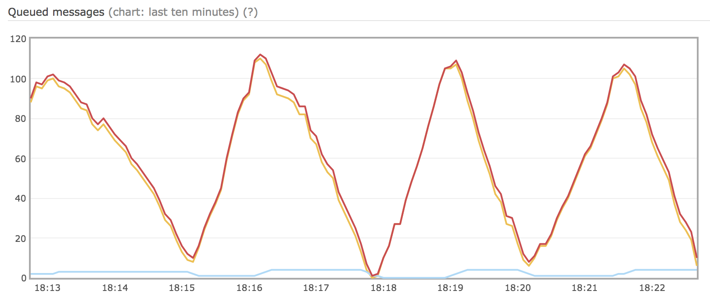
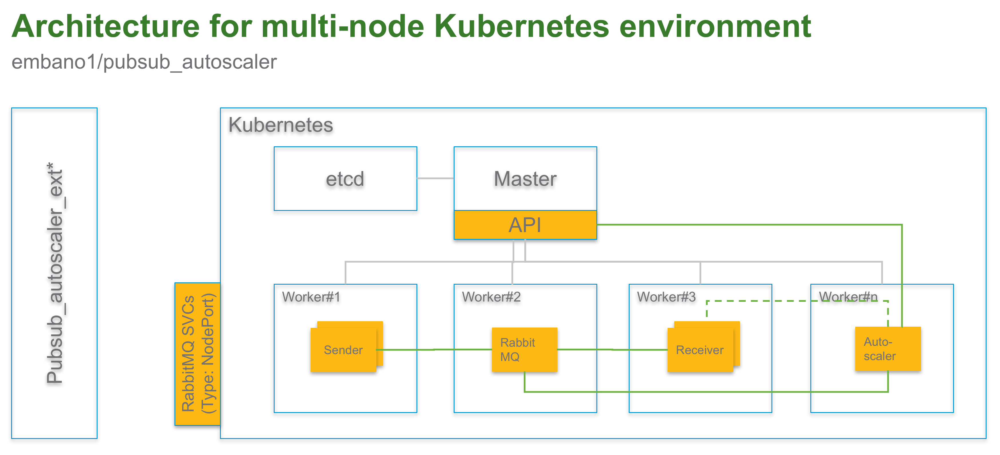

# Overview
## This demo
This demo is a proof of technology I did for a customer. It´s a simple Kubernetes pod based autoscaler which scales the backend pods based on the queue depth of the message broker. You´ll find the following components here:

	- Kubernetes service for RabbitMQ (service discovery, ext. access for mgmt. UI)
	- Kubernetes deployments for RabbitMQ, sender, receiver and autoscaler

The sender just generates random integers in random intervals, publishs them to RabbitMQ, where they´re pulled by *n* (autoscaled) workers which calculate the fibonacci sequence to simulate CPU load.  
Note: the code works, needs overhaul though (clean-up, etc.). Bear with me ,)

## Why not the HPA (horizontal pod autoscaler)? 
I wanted to use a custom metric, i.e. the queue depth of RabbitMQ as a trigger for scaling. Again, proof-of-concept only, code also needs some cleaning and can be shortened but works ,)  

## High-level architecture
  

# Quick Start
## Software requirements (to run the demo)
    - kubectl (tested with v1.6.4)
    - minikube (tested with v0.20.0)

## Run
    - Clone this repo with `git clone https://github.com/embano1/vmworld2017`
    - cd into the folder `03_autoscaling` on your machine
      - kubectl create -f kubernetes/  
      - (wait for images to be pulled and pods started)  
      - Access RabbitMQ UI through NodePort and NodeIP (see "Accessing RabbitMQ statistics" below)
      - Scale sender deployment and see how the system (RabbitMQ queue details) adapts: kubectl scale deploy sender --replicas=20
  
# Other
## Accessing RabbitMQ statistics
	- Get the NodePort of the service: kubectl describe service rabbitmq (for target port **15672** which is the mgmt. interface)
      - If you work with minikube, you can get the port of the RabbitMQ management UI with "minikube service list" (target port **15672**)
	- Access the management portal through your browser, e.g. http://$(minikube ip):30383/
	- Username/ password: guest/guest

## Get autoscaler metrics
    - kubectl get po | grep autoscaler  
    - kubectl logs -f <autoscaler_pod>

# Cleanup
    kubectl delete -f kubernetes/
